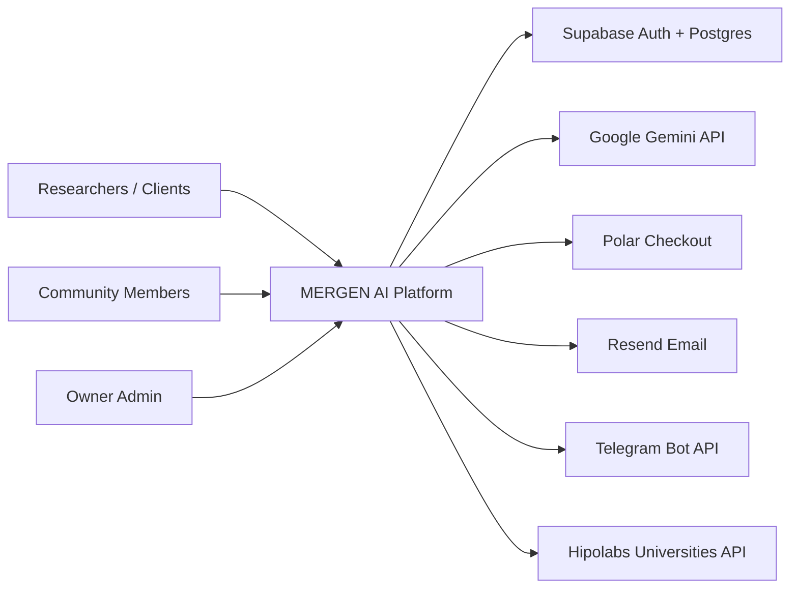
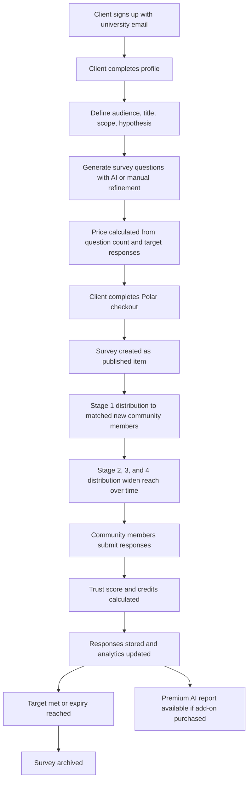
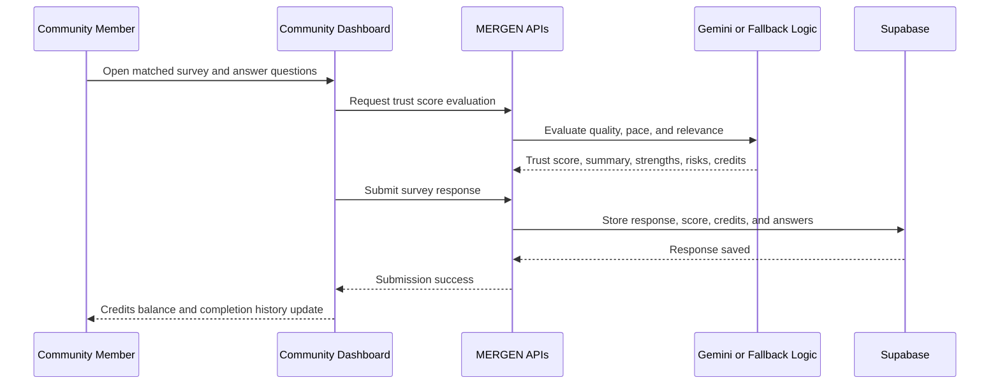
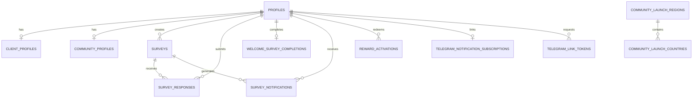

# MERGEN AI Business Analysis and Project Documentation

Version: 1.0  
Prepared as of: April 6, 2026  
Prepared by: IT Business Analyst  
Document type: Business Analysis, Product, Functional, and Technical Overview

## 1. Executive Summary

MERGEN AI is a two-sided academic research platform that connects researchers with a verified global community for survey-based data collection. The platform is designed for students, professors, research centers, and universities that need faster survey setup, more relevant respondents, higher response quality, and clearer insight generation.

The current solution combines:

- role-based sign-up and dashboards for researchers and community members
- university email validation for client accounts
- location- and capacity-controlled onboarding for community members
- AI-assisted survey drafting
- paid survey launch through Polar checkout
- staged survey distribution through email and Telegram
- AI/fallback trust scoring for response quality and reward allocation
- AI/fallback reporting for premium survey insights
- an owner-only admin console for survey and community oversight

In business terms, MERGEN AI addresses four linked problems:

1. researchers spend too much time writing surveys and recruiting the right respondents
2. survey responses often vary in quality and are hard to trust
3. community participants need clear incentives and relevant studies
4. platform owners need operational visibility across growth, distribution, and rewards

## 2. Business Context

### 2.1 Problem Statement

Academic researchers often face:

- difficulty reaching a qualified respondent pool
- high manual effort in survey design
- low confidence in response quality
- slow conversion of raw responses into useful findings

Potential respondents face:

- low motivation to participate
- poor survey relevance
- unclear reward structures
- limited trust in how their time is valued

MERGEN AI positions itself as a structured marketplace and workflow layer between both sides.

### 2.2 Product Vision

Create an academic research ecosystem where researchers can move from idea to insight quickly, while community members receive relevant surveys and fair rewards for thoughtful participation.

### 2.3 Core Value Proposition

For researchers:

- targeted access to a qualified international audience
- faster survey creation through AI assistance
- better confidence in collected data through trust scoring
- structured reporting support for decision-making

For community members:

- access to relevant surveys that match profile attributes
- transparent credits and reward redemption
- welcome onboarding and recurring engagement loops
- optional Telegram alerts for new matched surveys

For platform owners:

- controlled staged launch across regions
- visibility into survey distribution, community growth, and reward usage
- direct operational control through server-protected admin views

## 3. Business Goals and Success Measures

### 3.1 Business Goals

| Goal ID | Business Goal | How the current product supports it |
| --- | --- | --- |
| BG-01 | Reduce survey launch effort for researchers | Guided creation flow, AI-generated questions, pricing automation, and payment-backed launch |
| BG-02 | Improve response relevance and quality | Audience matching, staged delivery, trust scoring, and completion controls |
| BG-03 | Build an engaged global respondent community | Controlled rollout, welcome survey, credits, rewards, and notifications |
| BG-04 | Make survey operations measurable and governable | Admin dashboards, notification logs, survey lifecycle tracking, and reward ledger |
| BG-05 | Support academic market positioning | University email checks, academic pricing, and academic audience-focused messaging |

### 3.2 Suggested KPIs

The repository does not persist a formal KPI framework, so the following KPIs are recommended from a BA perspective:

- client sign-up conversion rate
- community sign-up approval rate by country and region
- paid survey launch rate
- average time from sign-up to first survey publication
- percentage of surveys reaching target responses before expiry
- average trust score by survey and by audience segment
- average credits earned and redeemed per member
- Telegram/email notification delivery success rate
- premium AI report attach rate

## 4. Stakeholders and Personas

### 4.1 Stakeholder Map

| Stakeholder | Interest in the product | Primary responsibilities |
| --- | --- | --- |
| Students | Run thesis, capstone, and dissertation research | Create surveys, define audience, review insights |
| Professors and researchers | Conduct academic studies | Launch larger research projects and use analytics |
| Universities and research centers | Institutional research execution | Sponsor or manage research operations |
| Community members | Participate in surveys and earn rewards | Maintain profiles, answer surveys, redeem credits |
| Owner admin | Monitor and govern platform operations | Review live surveys, launch progress, credits, rewards |
| Product team | Improve adoption and reliability | Prioritize roadmap and operational policies |
| Engineering team | Deliver and maintain functionality | Build UI, APIs, integrations, and security controls |
| Support and operations | Resolve issues and monitor workflows | Investigate sign-up, payment, notification, and reward issues |

### 4.2 Personas

#### Persona A: Student Researcher

- Goal: launch a thesis survey quickly without deep survey-design expertise
- Needs: university-based access, guided authoring, targeted respondents, basic reporting
- Pain points solved: recruitment difficulty, time-consuming survey design, weak response quality

#### Persona B: Faculty or Institutional Research Lead

- Goal: run broader academic studies with defined audience criteria
- Needs: larger response targets, auditable distribution, analytics, premium AI reporting
- Pain points solved: manual coordination, inconsistent quality, fragmented reporting

#### Persona C: Community Member

- Goal: complete relevant surveys and convert participation into rewards
- Needs: fair matching, mobile-friendly flows, transparent credits, optional notifications
- Pain points solved: irrelevant surveys, unclear benefit, lack of engagement loop

#### Persona D: Platform Owner

- Goal: control community growth, survey delivery, and financial/reward exposure
- Needs: visibility into live surveys, region capacity, credits, rewards, and member distribution
- Pain points solved: unmanaged rollout, poor operational insight, no audit trail

## 5. Scope

### 5.1 In Scope

- public landing page and marketing content
- role selection and role-based authentication
- client sign-up with university eligibility validation
- community sign-up with location and capacity eligibility validation
- profile storage in Supabase
- client dashboard and survey creation flow
- AI-powered survey question generation
- survey pricing and checkout initiation through Polar
- survey persistence, publication, lifecycle, and archival
- staged survey distribution to matched community members
- response submission and trust-score-based crediting
- welcome survey for new community members
- community rewards and redemption ledger
- Telegram notification linking and message delivery
- contact form and legal acceptance capture
- owner admin dashboards for surveys and community monitoring

### 5.2 Out of Scope in the Current Implementation

- recurring subscription billing
- enterprise contract management
- multi-admin role hierarchy or granular RBAC
- native mobile applications
- multilingual content management
- advanced survey editing workflow after publication
- automated reward fulfillment with external payout systems
- full two-factor authentication workflow despite a stored preference flag

## 6. Assumptions, Dependencies, and Constraints

### 6.1 Assumptions

- client users are legitimate academic or institutional researchers
- community profile data is sufficiently accurate for matching
- AI output is useful but may require human review
- external services remain available and correctly configured
- scheduled distribution is triggered by an external cron caller

### 6.2 External Dependencies

- Supabase Auth and Postgres
- Google Gemini API
- Resend email API
- Polar checkout API
- Telegram Bot API
- Hipolabs Universities API
- Vercel or equivalent Next.js hosting

### 6.3 Constraints

- Node.js 20+ runtime expectation
- admin access is controlled through configured admin email values
- first-stage community rollout is limited to predefined countries and regional caps
- custom avatars are intentionally stored in browser local storage, not auth metadata
- premium AI reporting depends on the survey purchasing the AI add-on

## 7. Product Overview

### 7.1 Role Model

The platform uses two application roles:

- `client`: researcher-side user
- `community`: respondent-side user

Admin access is not a separate database role. It is derived from a configured email (`ADMIN_EMAIL` or `ADMIN_EMAILS`) and routes the matching signed-in client account into the owner admin area.

### 7.2 Capability Matrix

| Capability | Client | Community | Admin |
| --- | --- | --- | --- |
| Sign up / log in | Yes | Yes | Uses client account with admin email |
| Maintain personal profile | Yes | Yes | Yes |
| Create surveys | Yes | No | No direct authoring flow in admin |
| Generate AI survey questions | Yes | No | No |
| Pay for survey launch | Yes | No | No |
| View live survey analytics | Yes | No | Yes, from oversight views |
| Submit survey responses | No | Yes | No |
| Earn credits | No | Yes | No |
| Redeem rewards | No | Yes | View-only oversight |
| Receive email survey notifications | No | Yes | No |
| Receive Telegram alerts | No | Yes | No |
| Review active surveys across platform | No | No | Yes |
| Review community health and reward metrics | No | No | Yes |

### 7.3 Major User Journeys

#### Researcher Journey

1. Select client path
2. Sign up using university email
3. Complete profile
4. Define research target and survey criteria
5. Generate AI-assisted questionnaire
6. Review pricing and pay
7. Publish survey
8. Trigger or wait for staged respondent distribution
9. Monitor responses and analytics
10. Generate premium AI report when applicable

#### Community Journey

1. Select community path
2. Pass geolocation and capacity eligibility checks
3. Complete demographic and interest profile
4. Take welcome survey for first credits
5. Receive matched surveys
6. Submit responses
7. Receive credits based on response quality
8. Redeem rewards
9. Optionally link Telegram for alerts

#### Admin Journey

1. Sign in using configured admin email
2. Review active surveys and completion progress
3. Inspect launch and notification activity
4. Review community demographics, trust, credits, and reward activations
5. Use insight to manage rollout and operational risk

## 8. Business Process and BA Diagrams

### 8.1 System Context Diagram

### 8.2 End-to-End Survey Lifecycle

### 8.3 Response Quality and Reward Sequence

### 8.4 Core Data Model

## 9. Launch Geography and Rollout Strategy

### 9.1 First-Stage Community Launch Capacity

The current staged launch model supports 10,000 total community members across the following regions:

| Region | Target members | Countries |
| --- | ---: | --- |
| North America | 1500 | United States, Canada |
| Latin America | 1000 | Brazil, Mexico, Argentina, Chile, Uruguay, Colombia |
| Western Europe | 1000 | United Kingdom, Germany, France, Netherlands, Belgium |
| Eastern Europe | 900 | Poland, Czech Republic, Hungary, Romania, Slovenia, Serbia, Ukraine |
| Northern Europe | 500 | Sweden, Norway, Denmark, Finland |
| Western Asia | 700 | Turkey, Azerbaijan, Georgia, Armenia, Saudi Arabia, United Arab Emirates, Israel, Jordan, Lebanon, Iraq, Iran |
| Central Asia | 300 | Kazakhstan, Uzbekistan, Kyrgyzstan |
| South Asia | 1200 | India, Pakistan, Bangladesh |
| Southeast Asia | 1000 | Indonesia, Malaysia, Singapore, Thailand, Vietnam, Philippines |
| Eastern Asia | 800 | Japan, South Korea, Taiwan, Hong Kong |
| Oceania | 400 | Australia, New Zealand |
| North Africa | 300 | Egypt, Morocco, Algeria |
| West Africa | 200 | Nigeria, Ghana, Senegal |
| East Africa | 200 | Kenya, Tanzania, Ethiopia |

### 9.2 Distribution Expansion Logic

Survey distribution widens in controlled stages:

- Stage 1: immediate, targeted distribution to qualified members with zero prior survey completions
- Stage 2: after 5 hours, next matched group
- Stage 3: after 1 additional day, same country set but relaxed socio-economic filters
- Stage 4: after 1 additional day, expands country targeting to the full region(s) of the chosen countries

This strategy balances relevance, fairness for new members, and response target attainment.

## 10. Pricing Model

### 10.1 Standard Survey Pricing Matrix

Base price is determined by question tier and target respondent count.

| Question tier | 50 responses | 100 responses | 250 responses | 500 responses | 1000 responses |
| --- | ---: | ---: | ---: | ---: | ---: |
| 5 questions | $50 | $90 | $200 | $350 | $650 |
| 10 questions | $70 | $120 | $280 | $500 | $900 |
| 15 questions | $90 | $160 | $350 | $650 | $1200 |
| 20 questions | $110 | $200 | $450 | $800 | $1500 |
| 25 questions | $130 | $240 | $550 | $1000 | $1900 |

### 10.2 Optional Add-on

- Detailed AI report add-on: +$20

### 10.3 Survey Window Rules

| Target responses | Active survey window |
| ---: | --- |
| Below 500 | 3 days |
| 500 to 999 | 5 days |
| 1000 | 7 days |

## 11. Use Case Catalogue

| Use case ID | Actor | Use case | Outcome |
| --- | --- | --- | --- |
| UC-01 | Client | Register with university email | Client account created and routed to researcher dashboard |
| UC-02 | Community member | Register from eligible country | Community account created if region capacity allows |
| UC-03 | Client | Create survey definition | Survey audience, scope, and requirements captured |
| UC-04 | Client | Generate AI questionnaire | Draft survey questions returned for review |
| UC-05 | Client | Pay for survey | Polar checkout confirms payment eligibility for launch |
| UC-06 | System | Publish and distribute survey | Survey becomes available and notifications are sent in stages |
| UC-07 | Community member | Complete welcome survey | First credits awarded and onboarding progresses |
| UC-08 | Community member | Complete standard survey | Response stored, trust scored, credits assigned |
| UC-09 | Client | Review survey analytics | Progress, raw data, and charted results are available |
| UC-10 | Client | Request AI report | Executive summary and recommendations generated if add-on purchased |
| UC-11 | Community member | Redeem reward | Reward activation logged and credits deducted from available balance |
| UC-12 | Community member | Link Telegram | Matching phone-based Telegram notifications enabled |
| UC-13 | Admin | Monitor platform operations | Live surveys, member distribution, credits, and rewards are visible |

## 12. Business Rules

| Rule ID | Business rule |
| --- | --- |
| BR-01 | Only two application roles exist in the data model: `client` and `community`. |
| BR-02 | Admin access is email-based and attached to a configured account, not a separate DB role. |
| BR-03 | Client registration requires a valid university-style email; configured admin email is exempt from this rule. |
| BR-04 | Community registration is allowed only when the detected country maps to the first-stage launch geography. |
| BR-05 | Community registration is blocked when the country's region has reached its target member capacity. |
| BR-06 | Community country values are normalized to canonical launch-country names. |
| BR-07 | Survey audience countries must remain inside the first-stage launch geography. |
| BR-08 | Standard UI pricing supports 5, 10, 15, 20, or 25 questions and 50, 100, 250, 500, or 1000 target responses. |
| BR-09 | Detailed AI reporting is an optional paid add-on priced separately from the base survey price. |
| BR-10 | Standard surveys are created as published surveys and later archived when expired or completed. |
| BR-11 | Stage 1 distribution prioritizes community members with zero prior survey completions. |
| BR-12 | Stage 3 broadens audience reach by relaxing education, interests, salary, residence, and family filters. |
| BR-13 | Stage 4 broadens geographic reach to all countries in the same rollout region(s) as the selected audience countries. |
| BR-14 | A respondent can submit only one response per standard survey. |
| BR-15 | Welcome survey can be completed only once per respondent. |
| BR-16 | Welcome survey awards a fixed 50 credits. |
| BR-17 | Standard survey rewards range from 20 to 70 credits based on trust score. |
| BR-18 | Detailed AI survey reports require both add-on purchase and available raw responses. |
| BR-19 | Reward activation is blocked if available credits are lower than reward cost. |
| BR-20 | Telegram linkage requires a matching stored phone number and a valid short-lived token. |
| BR-21 | Production cron and Telegram webhook endpoints must be protected by configured secrets. |

## 13. Functional Requirements

### 13.1 Acquisition and Authentication

| FR ID | Requirement |
| --- | --- |
| FR-01 | The system shall provide a public landing page that explains the academic research value proposition. |
| FR-02 | The system shall allow users to choose between client and community registration paths. |
| FR-03 | The system shall support email/password sign-up and login through Supabase Auth. |
| FR-04 | The system shall redirect authenticated users to the correct dashboard based on role and admin status. |
| FR-05 | The system shall refresh authenticated sessions across `/auth/*` and `/dashboard/*` routes. |

### 13.2 Client Onboarding and Profile

| FR ID | Requirement |
| --- | --- |
| FR-06 | The system shall validate client email eligibility using university-domain logic and, when possible, university directory lookup. |
| FR-07 | The system shall capture client profile data including name, email, phone, country, institution, and position. |
| FR-08 | The system shall persist client profile data into shared and role-specific profile tables. |

### 13.3 Community Onboarding and Profile

| FR ID | Requirement |
| --- | --- |
| FR-09 | The system shall detect the community applicant's country from request headers. |
| FR-10 | The system shall block community registration outside the staged launch geography. |
| FR-11 | The system shall block community registration when regional capacity is full. |
| FR-12 | The system shall capture detailed community profile attributes for demographic and interest-based matching. |
| FR-13 | The system shall support community profile updates after registration. |

### 13.4 Survey Authoring and Publishing

| FR ID | Requirement |
| --- | --- |
| FR-14 | The system shall allow client users to define a survey title, description, research scope, hypothesis, audience, and question count. |
| FR-15 | The system shall allow AI-assisted generation of survey questions using Gemini. |
| FR-16 | The system shall normalize and store generated survey questions in a structured format. |
| FR-17 | The system shall calculate survey price based on question tier and target respondents. |
| FR-18 | The system shall create a Polar checkout session for eligible client users. |
| FR-19 | The system shall create a published survey record with rollout metadata after successful payment handling in the client flow. |
| FR-20 | The system shall allow clients to archive their own surveys. |

### 13.5 Audience Matching and Distribution

| FR ID | Requirement |
| --- | --- |
| FR-21 | The system shall match surveys to community members using age, country, gender, education, interests, salary, residence, and family status. |
| FR-22 | The system shall apply staged distribution rules that widen the addressable audience over time. |
| FR-23 | The system shall notify matched members through email and, where linked, Telegram. |
| FR-24 | The system shall record notification history per survey and recipient. |
| FR-25 | The system shall expose a protected cron endpoint to execute scheduled distribution cycles. |

### 13.6 Response Collection and Quality

| FR ID | Requirement |
| --- | --- |
| FR-26 | The system shall expose community-available surveys excluding previously submitted surveys. |
| FR-27 | The system shall show a welcome survey to eligible new community members before any standard survey completion. |
| FR-28 | The system shall evaluate standard survey responses for trust and reward value using AI or fallback logic. |
| FR-29 | The system shall store response answers, completion time, trust score, credits, and summary. |
| FR-30 | The system shall automatically archive surveys when the target response count is reached. |

### 13.7 Analytics and Reporting

| FR ID | Requirement |
| --- | --- |
| FR-31 | The system shall provide client-side analytics views for survey progress and response summaries. |
| FR-32 | The system shall provide downloadable raw response data in CSV format. |
| FR-33 | The system shall generate a detailed AI report for surveys that purchased the add-on and have response data. |
| FR-34 | The system shall fall back to non-AI reporting logic when Gemini is unavailable. |

### 13.8 Rewards and Engagement

| FR ID | Requirement |
| --- | --- |
| FR-35 | The system shall maintain a credits-based reward economy for community members. |
| FR-36 | The system shall expose a rewards catalog grouped by category. |
| FR-37 | The system shall create reward activation ledger entries when redemption succeeds. |
| FR-38 | The system shall allow community members to link Telegram notifications through a bot activation flow. |

### 13.9 Admin and Support

| FR ID | Requirement |
| --- | --- |
| FR-39 | The system shall provide an owner-only survey oversight dashboard. |
| FR-40 | The system shall provide an owner-only community dashboard with demographic, trust, and reward metrics. |
| FR-41 | The system shall support contact form submission to a configured inbox through Resend. |

## 14. Non-Functional Requirements

| NFR ID | Category | Requirement |
| --- | --- | --- |
| NFR-01 | Security | All protected APIs shall verify authenticated identity and role before allowing access. |
| NFR-02 | Security | Database access shall use row-level security for user-owned data domains. |
| NFR-03 | Security | Admin access shall be restricted to configured admin email values. |
| NFR-04 | Security | Cron and webhook endpoints shall require secrets in production. |
| NFR-05 | Reliability | The system shall fall back to deterministic logic when AI services are unavailable for trust scoring and reporting. |
| NFR-06 | Reliability | The system shall preserve unique response constraints to prevent duplicate submissions. |
| NFR-07 | Performance | External AI calls currently use 30-second request timeouts; university lookup uses a 6-second timeout. |
| NFR-08 | Scalability | Distribution logic shall support staged mass notifications using chunked email and Telegram sends. |
| NFR-09 | Maintainability | Business rules are centralized in TypeScript utility modules and SQL triggers/policies. |
| NFR-10 | Auditability | Survey notifications, reward activations, and response submissions shall be stored in persistent tables. |
| NFR-11 | Privacy | Legal acceptance timestamps and policy versions shall be captured during sign-up metadata creation. |
| NFR-12 | Compatibility | The application shall run on a Next.js 14 / Node 20+ environment. |

## 15. Data and Information Model

### 15.1 Core Data Entities

| Entity | Purpose | Key notes |
| --- | --- | --- |
| `profiles` | Shared identity and base account data | One record per authenticated user |
| `client_profiles` | Client-only research profile data | Linked 1:1 to `profiles` |
| `community_profiles` | Community demographic and interest data | Linked 1:1 to `profiles` |
| `community_launch_regions` | Rollout region capacity model | Stores regional target member limits |
| `community_launch_countries` | Country-to-region mapping | Used for sign-up and audience validation |
| `surveys` | Survey master records | Stores audience, questions, research context, and distribution metadata |
| `survey_responses` | Standard survey submissions | Includes trust score, credits, summary, and answers |
| `welcome_survey_completions` | Welcome survey submissions | Fixed credit onboarding mechanic |
| `survey_notifications` | Distribution log | Tracks which members were sent a survey |
| `reward_activations` | Reward redemption ledger | Tracks reward type, credits, and status |
| `telegram_notification_subscriptions` | Verified Telegram links | Stores chat linkage and status |
| `telegram_link_tokens` | Temporary verification tokens | Supports secure phone-matched Telegram activation |

### 15.2 Data Captured for Client Users

- first name
- last name
- email
- phone number
- country
- educational institution
- position
- appearance preference
- stored two-factor preference flag

### 15.3 Data Captured for Community Users

- first name
- last name
- email
- phone number
- country
- age span
- gender
- employment status
- industry
- salary range
- educational level
- field of study
- language skills
- English proficiency
- place of residence
- family status
- household size
- children count
- interests
- car count
- appearance preference
- stored two-factor preference flag

### 15.4 Stored Survey Data

- title and description
- target responses
- questions and question count
- audience definition
- research description
- research scope
- hypothesis
- premium AI report flag
- stage/timing metadata for distribution
- lifecycle timestamps

## 16. Integrations and Interfaces

| Integration | Purpose | Interface usage in current implementation |
| --- | --- | --- |
| Supabase Auth | Authentication and identity | Sign-up, login, sessions, auth-triggered profile creation |
| Supabase Postgres | Persistent application data | Profiles, surveys, responses, rewards, Telegram link data |
| Gemini 2.5 Flash | AI generation and analysis | Survey drafting, trust scoring, premium survey reports |
| Polar | Payment checkout | One-time survey checkout session and payment verification |
| Resend | Email delivery | Contact form email and survey launch notifications |
| Telegram Bot API | Community notifications | Link verification and survey alert delivery |
| Hipolabs Universities API | Academic email validation support | Institution-domain validation and university list lookup |

## 17. Security, Access Control, and Compliance Considerations

### 17.1 Security Controls Present

- Supabase-backed authentication
- SSR session refresh middleware on protected paths
- role-aware API authorization checks
- row-level security on profile, survey, response, reward, and Telegram tables
- admin route gating by configured email
- cron bearer-token protection
- Telegram webhook secret validation

### 17.2 Data Access Model

- users can view and update only their own profile records
- clients can create, read, and update only their own surveys
- community members can view published surveys and submit their own responses
- survey owners can view responses to their own surveys
- community members can view and create only their own reward activations
- community members can view their own Telegram subscription status

### 17.3 Compliance Observations

The current implementation includes:

- terms and privacy acceptance version capture
- privacy and terms pages
- role-based access separation
- controlled storage of profile and survey data

Recommended follow-up work for formal compliance readiness:

- retention policy definition
- data deletion/export procedures
- explicit consent review for notifications and profiling
- legal review for cross-border respondent data handling

## 18. Reporting and Analytics

### 18.1 Client-Facing Analytics

Current client analytics capabilities include:

- survey progress against response target
- average trust score
- average completion time
- raw response access
- question-level charts
- timeline and distribution summaries
- downloadable CSV raw data
- AI-generated executive report for premium surveys

### 18.2 Admin-Facing Analytics

Current admin metrics include:

- active surveys
- live response counts
- total notifications sent
- active client count
- expiring-soon surveys
- community member counts
- launch progress against capacity
- average trust score
- earned, redeemed, and available credits
- reward activation trends
- country, region, age, gender, and interest distributions

## 19. Risks, Gaps, and Recommendations

| ID | Risk or gap | Impact | Recommendation |
| --- | --- | --- | --- |
| R-01 | Admin model is email-based rather than role-based RBAC | Harder to scale governance and delegated operations | Introduce formal admin roles and permissions |
| R-02 | Two-factor capability is stored as a flag but no full 2FA workflow exists | Security posture may be overstated | Either implement real 2FA or remove the flag from UX claims |
| R-03 | Reward activation creates ledger entries but does not automate fulfillment | Manual operational workload and potential user confusion | Add fulfillment workflow and status transitions |
| R-04 | Survey distribution depends on an external cron caller | Delivery can stall if scheduler is misconfigured | Add monitoring and retry/alerting around cron execution |
| R-05 | AI quality depends on Gemini availability and response quality | Output variability for questions, scoring, and reports | Continue fallback logic and add human-review guidance in UX |
| R-06 | Launch geography is tightly controlled and partly hard-coded | Market expansion requires code/data updates | Externalize rollout management into admin-configurable data |
| R-07 | Custom avatars live only in local browser storage | Cross-device inconsistency for user profile visuals | Move avatar asset storage to object storage if needed |
| R-08 | Compliance and privacy operations are not fully documented in-system | Legal and operational risk as scale grows | Add retention, deletion, export, and notification consent policies |

## 20. Recommended Future Roadmap Themes

- formal role-based admin and operations permissions
- richer survey editing and versioning after draft generation
- stronger panel management and segmentation controls
- automated reward fulfillment and payout integrations
- survey delivery monitoring and retry workflows
- deeper BI dashboards and KPI persistence
- multi-language community experience
- enterprise/university account management

## 21. Glossary

| Term | Meaning |
| --- | --- |
| Client | A researcher-side user who creates and funds surveys |
| Community member | A respondent-side user who completes surveys and earns credits |
| Trust score | A 0-100 quality score assessing response reliability and pacing |
| Credits | Internal reward points earned from welcome and standard survey completion |
| Reward activation | A redemption event that converts credits into a reward request |
| Distribution stage | Controlled step in the survey delivery sequence that broadens reach over time |
| Premium AI report | Optional paid survey insight report generated from response data |
| Launch geography | The current predefined list of countries and regional capacity targets for community onboarding |

## 22. Conclusion

MERGEN AI is currently implemented as a focused academic research platform with a clear two-sided operating model. Its strongest differentiators are targeted community onboarding, AI-assisted survey creation, response trust scoring, staged delivery, and a credits-based engagement loop. From a BA perspective, the product already shows a solid foundation for an MVP-to-growth transition, with the next maturity steps centered on governance, automation, operational monitoring, and compliance depth.
